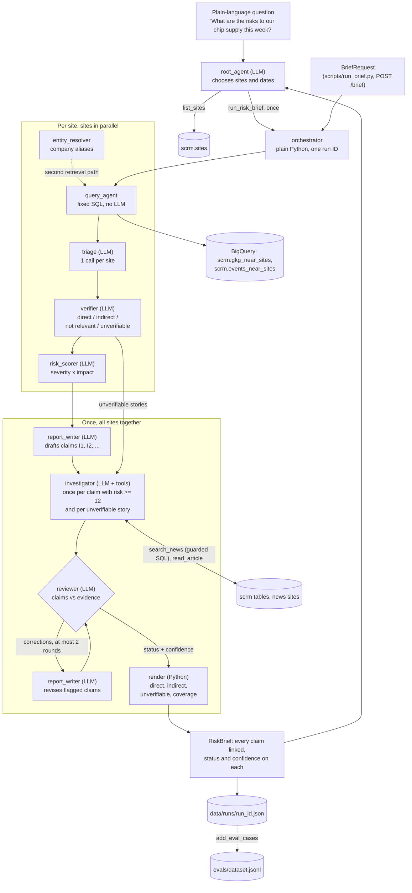

# CLAUDE.md

## Project
Multi-agent system that monitors GDELT news in BigQuery (dataset `scrm`, US multi-region)
for events that could disrupt a fictional laptop maker's 22 sites (12 suppliers, 6 ports,
4 chokepoints) and writes a daily Markdown risk brief with citations. Portfolio project:
readability and best practice beat feature count. Stack: Python 3.12, uv, Google ADK,
Gemini on Gemini Enterprise Agent Platform (formerly Vertex AI), BigQuery, Pydantic v2, FastAPI.

Pipeline (`src/scrm/agents/`), run by `orchestrator` (plain Python). Per site, in parallel:
1. `query_agent`: fixed, parameterised SQL over `scrm.*` (no LLM). Location path (inside
   the radius) + entity path (names the site's company, geocoded near another site).
   Ranks (`ranking.py`), clusters stories (`clustering.py`), returns up to 50
2. `entity_resolver`: deterministic alias table (`SITE_ALIASES`) + whole-word org matching
3. `triage`: one LlmAgent call per site over candidate metadata (no URLs) -> `TriageResult`
4. `verifier`: one article per triaged story; direct / indirect / not_relevant /
   unverifiable with a verbatim quote -> `VerifiedEvent` (verdict + scope)
5. `risk_scorer`: severity and impact 1-5 with a one-sentence reason -> `RiskScore`
Then once, for all sites:
6. `report_writer.draft_items`: merges findings into claims I1, I2, ... -> `BriefItem`s
7. `investigator`: LlmAgent + tools (guarded scrm search, article fetch), once per claim
   with risk >= 12 and once per unverifiable story -> `Investigation`
8. `reviewer`: critic loop; checks claims against verifier evidence and investigations,
   sends corrections to `report_writer.revise_items` (at most 2 rounds), sets status and
   confidence on every claim -> `ReviewRound`s
9. `report_writer.render`: direct, indirect, investigated unverifiable stories -> `RiskBrief`
`orchestrator.run_pipeline` returns `PipelineResult` (brief, per-site detail,
investigations, review rounds, model calls per agent). `root_agent` (LlmAgent with
`list_sites` and `run_risk_brief` tools) turns a plain-language question into sites and
dates, runs the pipeline once and answers; Python attaches the brief (`RootResult`).

## Commands
- Install: `uv sync`
- Test: `uv run pytest`
- Lint: `uv run ruff check . && uv run ruff format --check .`
- API locally: `uv run uvicorn scrm.api:app --reload --port 8080`
- Evals (verifier vs human labels: accuracy, precision, recall, disagreements):
  `uv run python -m evals.run_evals` (stored verdicts); add `--rerun-verifier` (with
  `--env-file .env`) to also score the current verifier on the labelled cases
- Add a saved run's stories to the eval set, unlabelled (appends, never rewrites):
  `uv run python -m scripts.add_eval_cases RUN_ID`
- Label eval cases: `uv run python -m scripts.label_evals`
- Brief (calls Gemini and BigQuery):
  `uv run --env-file .env python scripts/run_brief.py --sites P05 S01 C01 P02 --days 30 [--end YYYY-MM-DD] [--compare RUN_ID]`
  (saves the full result to `data/runs/<run_id>.json`, gitignored)
- Scripts show one-line progress and write full JSON logs to `data/logs/<run_id>.jsonl`;
  add `--verbose` to see the full log in the terminal
- Ask the root agent: `uv run --env-file .env python scripts/ask.py "What are the risks to our chip supply this week?"`
- BigQuery smoke test: `uv run --env-file .env python scripts/check_bigquery.py`
- Export scrm tables to Parquet (`data/*.parquet`, gitignored; checks row counts):
  `uv run --env-file .env python scripts/export_parquet.py`
(`make install|test|lint|format|api|evals` wraps these.)

## Hard constraints
- All BigQuery access goes through `scrm.tools.bigquery_tool.BigQueryTool`. It dry-runs
  every query and refuses it if estimated bytes exceed `SCRM_MAX_BYTES_BILLED`
  (default 10 GiB). Never call `bigquery.Client.query` anywhere else.
- Queries may read only from the `scrm` dataset, never from `gdelt-bq` directly, and
  must be `SELECT`. The guard enforces this through dry-run metadata; do not weaken it.
- Every agent returns a Pydantic model from `scrm/schemas.py`, never free text.
- Every claim in a brief carries the source URL it came from (`BriefItem.source_urls`).
  Models never write URLs or IDs: the report writer cites findings by ID and Python maps
  them back; confirmed findings a draft drops are still reported (verifier's reason).
- A "yes" verdict needs a quote found verbatim in the article; otherwise "unverifiable".
- Agent tools never take SQL or URLs from the model: the investigator's search runs fixed,
  parameterised SQL through `BigQueryTool`; results come back as IDs (R1..., F0) and only
  those can be fetched or cited. Tool calls are capped (investigator 8 per story, root
  agent 4 per question, pipeline at most once per question) and logged.
- The reviewer and report writer cite claims by ID; revisions may change claim text only,
  never sources, scope or scores.
- Never rewrite `evals/dataset.jsonl` while human labels may be in progress; append only
  (`scripts/add_eval_cases.py`). Human labels are never overwritten by code.
- Compare URLs with `scrm.urls.article_key` (http and https are the same article), never
  raw strings.
- Logging is structured JSON (`scrm.telemetry`). Every agent takes a `RunContext`, and
  work runs inside `ctx.bind()` so `run_id` appears on every log line.

## Conventions
- Type hints everywhere; small, single-purpose functions; Pydantic models at boundaries.
- No new dependencies without asking first. `pyarrow` is a dev-only dependency (Parquet
  export); runtime code must not import it.
- Every new tool gets tests alongside it (`tests/` mirrors `src/scrm/`).
- Model IDs come from settings (`SCRM_GEMINI_MODEL`); check current ADK and Gemini docs
  before changing ADK code or versions. Do not rely on memory.

## Cost and safety
- Never run a BigQuery query without the dry-run guard.
- Never commit credentials. Auth is Application Default Credentials only; no key files.
- Ask before deploying, creating GCP resources, or running anything that touches GCP.

## Status
- [x] Project skeleton, schemas, config, JSON logging with run IDs
- [x] BigQuery dry-run guard (cost, dataset allowlist, SELECT only) with tests
- [x] FastAPI `/health`; `/brief` runs the orchestrator (400 on unknown site_ids)
- [ ] Copy the three SQL files into `sql/`
- [ ] Expose `BigQueryTool` to `query_agent` as an ADK function tool (deferred: query_agent
      uses fixed SQL for now; revisit only if free-form questions are needed)
- [x] Implement `article_fetcher` (httpx, timeout, size cap)
- [x] First slice end to end for one site: `query_agent` -> `verifier` -> `report_writer`
      via `scripts/run_brief.py`, with tests
- [x] Story clustering in the query stage; cluster size as a ranking signal
- [x] Site-match ranking signal (site, operator or company named, not just the city)
- [x] `risk_scorer` (LlmAgent, severity and impact 1-5, one-sentence reason), with tests
- [x] Orchestrator: sites in parallel, one brief ordered by risk; `/brief` returns it
- [x] Eval dataset: 20 P05 candidates from run b3467493805d with verifier verdicts;
      `scripts/label_evals.py` records human labels; `run_evals.py` reports agreement
- [x] Human-labelled the 20 P05 eval cases; `run_evals.py` reports metrics. Verifier vs
      human (2026-10-07): accuracy 95%, precision 100% (5/5), recall 83% (5/6), coverage
      90%; one miss (NRC, Chinese dumping and Dutch factory closures: human yes, verifier no)
- [x] Added 66 unlabelled cases (S01, C01, P02, P05) from run 8f06003ab1a4 via
      `scripts/add_eval_cases.py`; 14 P05 stories already labelled were skipped
- [ ] Label those 66 cases; then re-run `run_evals.py --rerun-verifier` (on the 20 P05
      cases the new rubric scores the same as before: accuracy 95%, precision 100%, recall 83%)
- [x] Exported `scrm.sites`, `events_near_sites`, `gkg_near_sites` to `data/*.parquet`
      (2026-10-07, row counts match BigQuery) before the GCP credits expired
- [x] `entity_resolver`: alias table + whole-word org matching; second retrieval path
      (company named, geocoded near another site) and strongest ranking signal
- [x] `triage`: one call per site over up to 50 candidates. Run 10e2cf2f2b0a vs 8f06003ab1a4
      (same window): verifier calls 65 -> 39, rejection rate 85% -> 49% (P05 65% -> 12%,
      C01 78% -> 7%, S01 100% -> 100% (14/14), P02 100% -> 100% (3/3))
- [x] Verifier rubric direct / indirect / not_relevant; brief leads with direct findings
- [x] `investigator` (LlmAgent + guarded search and fetch tools, 8 tool calls per story)
- [x] Investigate once per story, after findings are merged into claims. Run 11ad747002b1 vs
      10e2cf2f2b0a (same window): investigations 13 -> 7, investigator calls 112 -> 57,
      total model calls 176 -> 108
- [x] `reviewer` critic loop (at most 2 revision rounds); every claim shows status and
      confidence (a failed later round keeps the previous round's status and confidence).
      In run 65381870a2f6 it caught a claim tying a storm warning to Hsinchu
      that the quote did not support, and the writer removed it
- [x] `root_agent`: plain-language question -> sites and dates -> pipeline as a tool ->
      answer with the brief attached (`scripts/ask.py`). "Chip supply this week" chose
      S01, S07, S09, S11 for 2026-10-01..07; 30 model calls
- [x] Reviewer sees the investigator's verbatim excerpts (checked against what it read),
      marked supports / contradicts / context. Run 7244c0eeeec1 (C01): the reviewer flagged
      "reducing Suez traffic" against "traffic operating normally ... revenue up 56.7%" and
      the pipeline restart, and the claim was rewritten to resolved after 2 revisions
- [x] Investigator variance: explicit status/confidence rules plus temperature 0.2
      (`SCRM_INVESTIGATOR_TEMPERATURE`; Google recommends the default for Gemini 3.x). Same
      S01 story x3: status unclear 3/3 both ways; confidence low 3/3 at 0.2, varied at default.
      Summaries still vary (README, Known limitations)
- [x] Showcase: all 22 sites, 2026-09-08..10-07 (run c8f070ecbfb2, 409 model calls),
      `docs/sample_brief.md`; per-agent calls in the README
- [ ] `docs/sample_questions.md` has 1 of 3 questions (chip supply). Shipping routes to
      Europe and a single-supplier question were not run: the GCP project hit its Vertex AI
      spend cap on 2026-10-07 during the showcase run. Raise the cap, then run scripts/ask.py
- [ ] Verifier with the rubric may be lenient on "indirect" for chokepoints: C01 confirmed
      12 of 12 judged in run 11ad747002b1. Label the C01 cases first
- [ ] S01 still has no confirmed disruption: the entity path finds TSMC mentions, mostly
      market news, and triage passes 16 of which 14 are rejected. Tighten triage for
      company-only matches; add factory themes to ranking
- [ ] Containerise and deploy (ask first)
