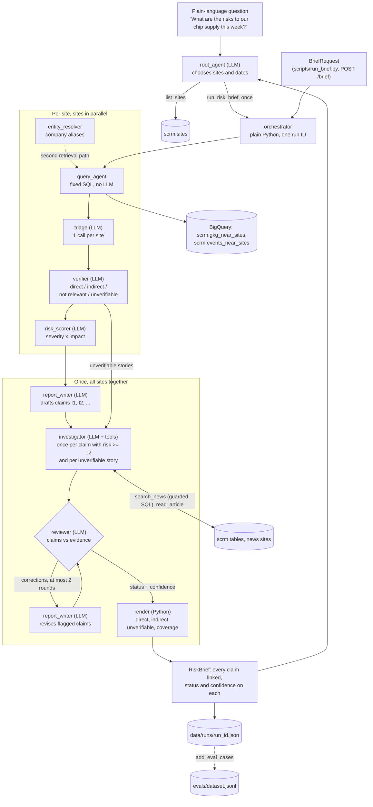

# Supply Chain Risk Monitor

A multi-agent system that watches global news (the [GDELT](https://www.gdeltproject.org/)
dataset in BigQuery) for events that could disrupt a company's suppliers, ports and
shipping routes, and writes a daily risk brief in which every claim links to its source.

The demo company is a fictional laptop maker with 22 real sites: 12 supplier factories,
6 ports and 4 shipping chokepoints.

> Status: the pipeline runs end to end for any list of sites
> (`uv run --env-file .env python scripts/run_brief.py --sites P05 S01 C01 P02`), producing one
> brief ordered by risk. Open problems are tracked in CLAUDE.md.

## How it works



The `orchestrator` runs the pipeline as plain Python: per site (in parallel) it retrieves
and ranks candidate stories, triages them, verifies the chosen ones by reading the article,
and scores confirmed disruptions. Then, for all sites at once, the report writer drafts
claims, the investigator checks each high-risk claim and each unverifiable story once,
and a reviewer critic loop corrects the claims (at most two rounds) and sets each claim's
status and confidence before the brief is rendered. Every run has one run ID on every
log line, so a brief can be traced end to end.

The `root_agent` sits on top: it turns a plain-language question into sites and dates,
runs the pipeline as a tool, and answers with the brief attached. Scripts print one-line
progress and keep the full JSON log in `data/logs/<run_id>.jsonl` (`--verbose` to show it)
(`uv run --env-file .env python scripts/ask.py "What are the risks to our chip supply this week?"`).

Built with [Google ADK](https://adk.dev/), Gemini on Gemini Enterprise Agent Platform
(formerly Vertex AI), BigQuery, Pydantic v2 and FastAPI.

## Design choices

- **Cost guard first.** Every query is dry-run before execution and refused above a
  configurable byte limit (default 10 GiB). It is also refused if it touches a table outside
  the `scrm` dataset or is anything other than a `SELECT`.
- **Structured output only.** Every agent returns a Pydantic model, never free text.
- **Models never handle URLs.** Agents see and cite IDs (findings, search results, claims);
  Python maps them back to sources, so a model cannot invent or alter a link.
- **Bounded agents.** Tool-using agents run fixed, parameterised queries through the cost
  guard, have per-task tool-call caps and log every call.
- **Citations are enforced by validation.** A `RiskBrief` whose Markdown omits a source URL
  fails validation.
- **No keys.** Authentication uses Application Default Credentials only.

## Showcase run

[`docs/sample_brief.md`](docs/sample_brief.md) is a full brief for all 22 sites over
2026-09-08 to 2026-10-07 (run `c8f070ecbfb2`): 1,076
candidate stories triaged, 171 sent to the verifier, 21 claims
after merging, 19 investigations, 4.5 GB of BigQuery scanned.
[`docs/sample_questions.md`](docs/sample_questions.md) shows the root agent answering a
plain-language question.

Model calls per agent in the showcase run:

| Agent | Model calls |
|---|---|
| verifier | 160 |
| investigator | 159 |
| risk_scorer | 65 |
| triage | 22 |
| report_writer | 2 |
| reviewer | 1 |
| **Total** | **409** |

One model request per row unit: the investigator counts every tool round-trip. The
reviewer's second round was refused when the GCP project reached its spend cap; the
brief keeps the first round's corrections, status and confidence.

## Known limitations

- **Investigator answers still vary somewhat between runs.** The investigator follows
  explicit rules for status and confidence and runs at temperature 0.2. Rerunning the same
  unverifiable S01 story three times gave the same status ("unclear") every time, and the
  same confidence ("low") every time at 0.2; at the default temperature confidence varied
  (medium, low, low). The summaries still differ in which facts they mention, and three
  runs of one story is a small sample. Google advises keeping Gemini 3.x models at their
  default temperature, so this setting is a deliberate trade-off
  (`SCRM_INVESTIGATOR_TEMPERATURE`).
- **Scores are not revised.** When the reviewer marks a claim resolved, the claim text is
  corrected and the item moves below live disruptions, but its severity and impact keep
  the risk scorer's original values.
- **Coverage depends on GDELT geocoding.** Only articles geocoded near a monitored site are
  in the `scrm` tables; the entity path widens this to articles near any monitored site.
- **Human labels are partial.** The verifier is evaluated on 20 labelled P05 cases; 66 more
  cases (S01, C01, P02, P05) await labels.

## Data

Dataset `scrm` (US multi-region), built from public GDELT tables by the SQL in `sql/`:

| Table | Contents |
|---|---|
| `scrm.sites` | The 22 monitored sites with coordinates and radius |
| `scrm.events_near_sites` | GDELT coded events (protests, strikes, sanctions, violence) near sites |
| `scrm.gkg_near_sites` | News articles with disruption themes near sites, with URL, themes, orgs, tone |

## Getting started

Requires Python 3.12 and [uv](https://docs.astral.sh/uv/).

```bash
gcloud auth application-default login
cp .env.example .env          # set GOOGLE_CLOUD_PROJECT
uv sync
uv run pytest
uv run uvicorn scrm.api:app --reload --port 8080
```

Then open http://localhost:8080/docs. The Makefile wraps these commands (`make test`, `make lint`, `make api`, `make evals`).

## Layout

```
src/scrm/agents/     one module per agent
src/scrm/tools/      bigquery_tool.py (guarded queries), article_fetcher.py
src/scrm/schemas.py  all Pydantic models
src/scrm/config.py   settings from environment variables
src/scrm/telemetry.py  JSON logging with run IDs
src/scrm/api.py      FastAPI: POST /brief, GET /health
evals/               labelled cases and the eval runner
sql/                 SQL that builds the scrm tables
tests/               mirrors src/
```
